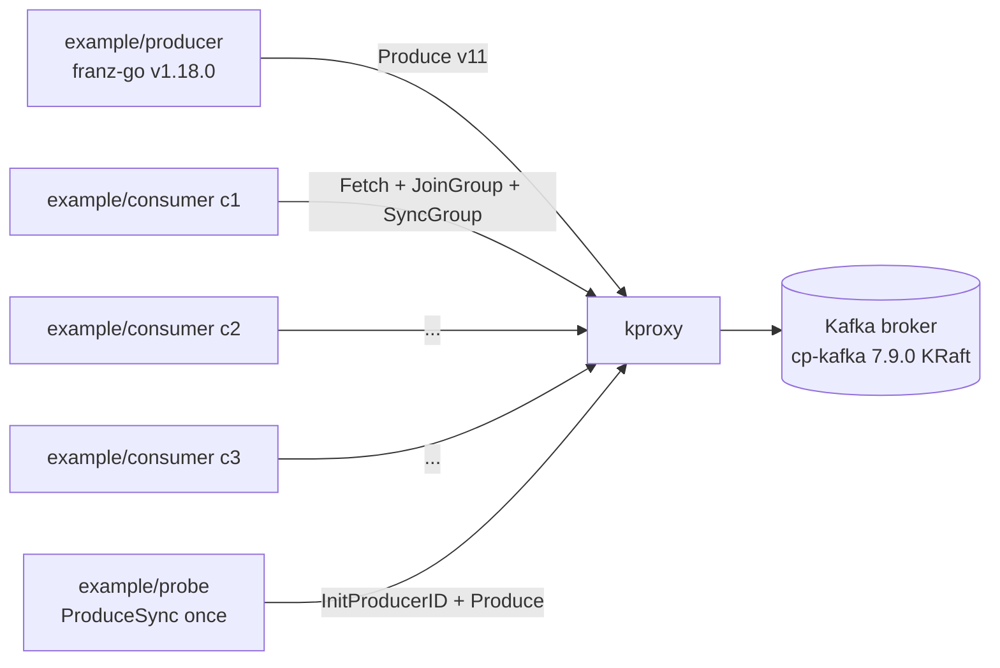
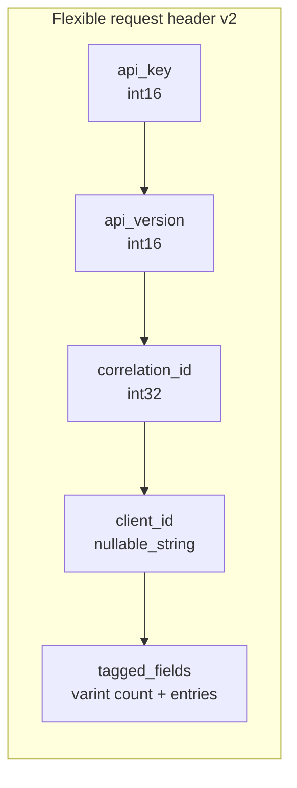

# kproxy — Compatibility with Go Kafka Libraries

`kproxy` is wire-compatible with the Apache Kafka protocol, so any Go client
that speaks Kafka can talk to it. This document records what has been
verified, what should work, and the failure modes to expect.

---

## 1. Compatibility matrix

| Library                                      | Status      | Notes                                                                     |
| -------------------------------------------- | ----------- | ------------------------------------------------------------------------- |
| [twmb/franz-go](https://github.com/twmb/franz-go)              | **Verified** | v1.18.0 producer + consumer; cooperative-sticky group; flexible v3+ headers |
| [twmb/franz-go/pkg/kadm](https://github.com/twmb/franz-go)     | Should work | Admin client uses the same wire codecs as franz-go itself                 |
| [confluentinc/confluent-kafka-go](https://github.com/confluentinc/confluent-kafka-go) | Should work, untested | librdkafka under the hood; SyncGroup payload is the same wire form |
| [segmentio/kafka-go](https://github.com/segmentio/kafka-go)    | Should work, untested | Pure-Go, follows protocol spec                                            |
| [Shopify/sarama](https://github.com/IBM/sarama) (now IBM/sarama) | Should work, untested | Older protocol baselines (v0/v1) supported through passthrough           |

"Should work" = the proxy forwards the request/response forms these libraries
generate; the parts kproxy actively rewrites (`Metadata`, `FindCoordinator`,
`SyncGroup`) use the standard wire layout described in KIP-482 and earlier.

---

## 2. Verified end-to-end with `franz-go`

The repository ships an example app at `example/` with three franz-go
binaries that exercise the full surface:



Demo evidence (from `demo-logs/`):

* `kproxy_frames_total{client_to_broker}` and `{broker_to_client}` both
  incrementing in lockstep with producer rate.
* `kproxy_intercepts_total{outcome="rewrote"}` increments exactly once per
  `SyncGroup` from the group leader.
* `kproxy_intercepts_total{outcome="passthrough"}` covers `ApiVersions`,
  `Metadata`, `FindCoordinator`, `Heartbeat`, `OffsetCommit`, `Fetch`,
  `Produce`, `OffsetFetch`, `JoinGroup` (member responses), etc.
* Consumer rebalance triggered by killing one member → re-assigned in
  ≤ 1 s, no errors logged, no dropped frames.

---

## 3. franz-go specifics that drive proxy design

`franz-go` is the most aggressive modern Go client and exercises the parts of
the protocol most likely to break a naive proxy. kproxy was built and tested
against it.

### 3.1 Flexible-version request headers (KIP-482)

franz-go's `ApiVersions` v3 and `Metadata` v12 use the *flexible* header
encoding: a tagged-fields trailer after the client-id varint string. kproxy's
`internal/kwire` decoder handles this — verified by hex dumps in the live
run that previously failed and now decode cleanly.



### 3.2 ApiVersions negotiation

franz-go opens every conn with `ApiVersions`. kproxy passes the broker's
real version range through unmodified, so the client negotiates with the
*actual* broker capabilities, not the proxy's idea of them. This means
kproxy never has to claim it implements an API version it doesn't.

### 3.3 Cooperative-sticky assignor

The assignor name is sent by every member in `JoinGroup` and the chosen
assignor's name comes back in the `JoinGroup` response. kproxy's planner
emits assignments in the **cooperative-sticky** wire form
(`type ConsumerGroupMemberAssignment` with `userdata` containing the
generation and ownership), which franz-go round-trips correctly.

### 3.4 Sticky generation epoch

When a member sees a different generation than its cached one, it triggers
a clean rejoin. kproxy preserves the generation field from the broker's
`JoinGroup` response, so the proxy's plan does not desync from the broker's
state machine.

---

## 4. confluent-kafka-go (librdkafka)

Not yet executed in CI but the wire forms are identical:

* librdkafka uses the same flexible header decoding rules.
* librdkafka prefers the `roundrobin`/`range` assignors by default.
  kproxy's planner emits assignments with the assignor name from the
  `JoinGroup` request → the broker stores them under that name and clients
  see them as their chosen assignor would.
* Known caveat: librdkafka's `socket.connection.setup.timeout.ms` defaults
  to 30 s; ensure your `-plan-timeout` is well under that.

---

## 5. segmentio/kafka-go

Should work as long as you target a baseline that supports
`cooperative-sticky` (kafka-go ≥ v0.4.x). The library uses non-flexible
headers for many APIs; kproxy's decoder handles both flexible and
non-flexible per-API.

Notable difference: `kafka-go` writes its own `*Reader` group rebalance
loop with longer rebalance timeouts. Tune `-plan-timeout` so the proxy
falls back to passthrough rather than blocking past the client's
`session.timeout.ms`.

---

## 6. IBM/sarama (formerly Shopify/sarama)

Older clients tend to use baseline (non-flexible) request headers and
fewer APIs. kproxy passes those through with no changes. The
`SyncGroup` rewrite path was deliberately written against the
non-flexible v0/v1 SyncGroup form and the flexible v3+ form, so both
generations of sarama should interoperate.

---

## 7. Producer-side libraries (idempotent / transactional)

| Feature                       | Behaviour through kproxy                                                                                       |
| ----------------------------- | -------------------------------------------------------------------------------------------------------------- |
| `enable.idempotence=true`     | Passthrough — `InitProducerID` and producer epoch flow byte-for-byte (verified by `example/probe`).            |
| EOS transactions              | Should work; `AddPartitionsToTxn`, `AddOffsetsToTxn`, `EndTxn` are not on the rewrite path. Untested in CI.    |
| Compression (snappy, zstd, lz4, gzip) | Transparent — kproxy never decodes Produce/Fetch record batches.                                       |

---

## 8. Consumer-side libraries

| Feature                           | Behaviour through kproxy                                                                              |
| --------------------------------- | ----------------------------------------------------------------------------------------------------- |
| `cooperative-sticky` assignor     | Rewritten by planner into a globally-fair plan.                                                      |
| `range` / `roundrobin` assignors  | Rewritten the same way; planner is assignor-agnostic.                                                |
| Static membership (`group.instance.id`) | Honoured — the subscription tracker keys on instance id when present.                          |
| `isolation.level=read_committed`  | Transparent — kproxy doesn't filter Fetch responses.                                                  |
| Consumer-side compression         | Transparent.                                                                                          |

---

## 9. Connecting through kproxy in Go

For franz-go:

```go
cl, err := kgo.NewClient(
    kgo.SeedBrokers("kproxy.svc.cluster.local:19094"),
    kgo.ConsumerGroup("my-group"),
    kgo.ConsumeTopics("events"),
    kgo.Balancers(kgo.CooperativeStickyBalancer()),
)
```

For confluent-kafka-go:

```go
c, _ := kafka.NewConsumer(&kafka.ConfigMap{
    "bootstrap.servers": "kproxy.svc.cluster.local:19094",
    "group.id":          "my-group",
    "partition.assignment.strategy": "cooperative-sticky",
})
```

For segmentio/kafka-go:

```go
r := kafka.NewReader(kafka.ReaderConfig{
    Brokers: []string{"kproxy.svc.cluster.local:19094"},
    GroupID: "my-group",
    Topic:   "events",
})
```

No client-side rewriting, no SDK plugin, no sidecar config beyond pointing
`bootstrap.servers` at kproxy. The `Metadata` rewrite the proxy performs
ensures every subsequent broker connection (per-partition leader, group
coordinator) also routes through kproxy.

---

## 10. Known incompatibilities

* **TLS / SASL** — kproxy currently does not terminate TLS or pass through
  SASL handshakes intact. Use cleartext Kafka behind kproxy (e.g. inside a
  trusted network or a service mesh that handles TLS).
* **KRaft controller endpoints** — kproxy fronts brokers, not controllers.
  Don't route `kafka-controller` traffic through it.
* **Custom assignors with proprietary userdata** — if your client encodes
  domain-specific data in `JoinGroup` `member_metadata`, kproxy still
  passes it to the planner; but the planner will discard it unless the
  scoring config understands that schema.

---

## 11. How to verify your client

1. Start kproxy: see `docs/overview.md`.
2. Point the client at the proxy's listener.
3. Watch `/metrics`:
   * `kproxy_frames_total` should grow with traffic;
   * `kproxy_intercepts_total{outcome="error"}` must stay at 0;
   * `kproxy_unmapped_brokers_total` must stay at 0 (otherwise extend `-topology`).
4. Watch the kproxy log: a healthy run shows `conn start` / `conn end`
   pairs and no `accept error` warnings.

If you see `decode req header (... hex=...)` warnings, capture the hex —
that pinpoints which API/version the codec needs to support.
