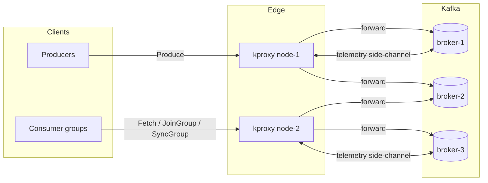
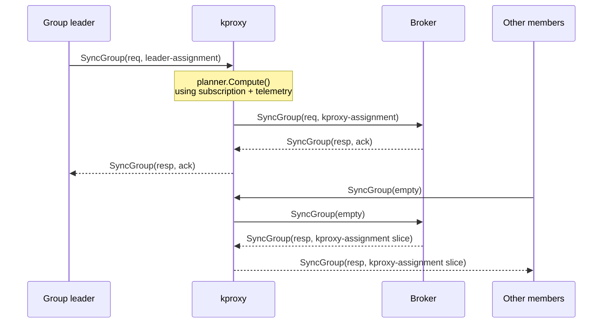
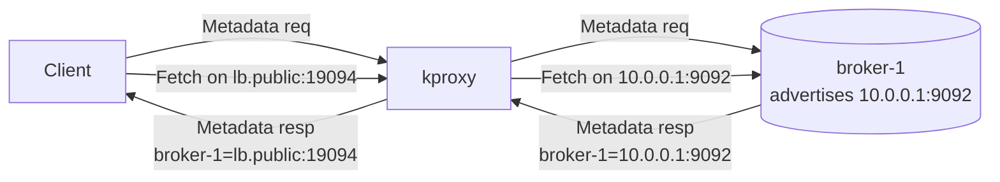
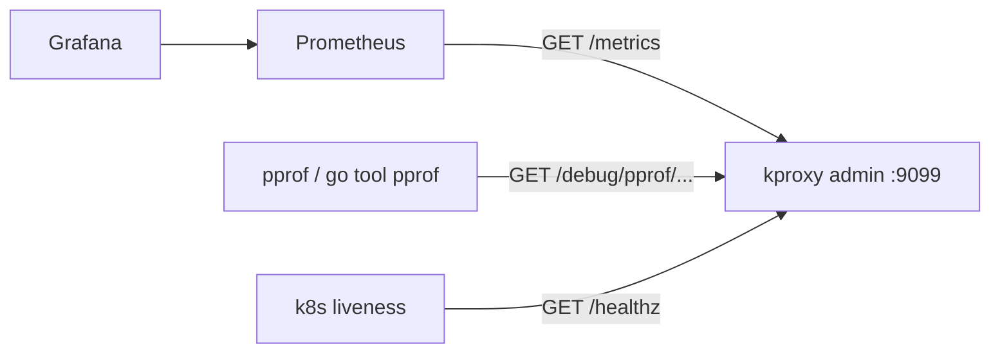
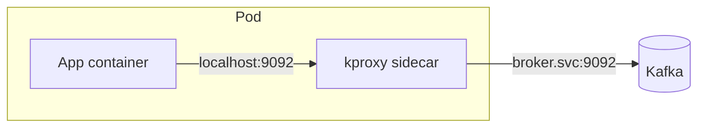
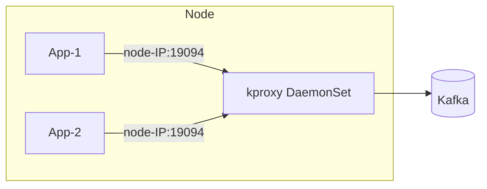
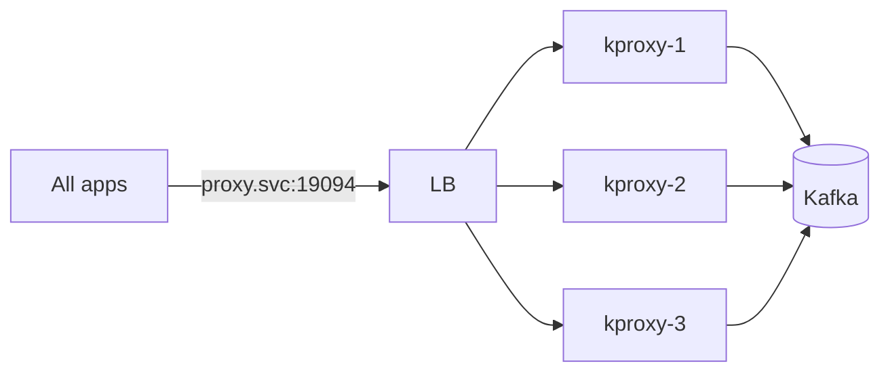

# kproxy — Production Use Cases

`kproxy` is a transparent, in-protocol Kafka proxy. It speaks the Kafka wire
protocol on both sides, intercepts a small set of group-management requests
(`JoinGroup` / `SyncGroup` / `Metadata` / `FindCoordinator`), and forwards
everything else byte-for-byte. This document describes where it fits in
production and the problems it solves.

---

## 1. Why a proxy at all?

Apache Kafka assigns partitions to consumers using a per-group rebalance
protocol that is local to a single consumer group. The broker hosting the
`__consumer_offsets` partition (the "group coordinator") relays subscription
metadata between members and lets one of them — the *group leader* — compute
the assignment. Each group decides in isolation.

That works perfectly when groups don't compete for resources. It breaks down
in three production patterns:

1. **Multi-tenant clusters** — many small services share the same brokers and
   the same set of partitions. One greedy group can starve others of broker
   I/O even though they consume different topics.
2. **Heterogeneous workloads** — some groups have CPU-bound consumers, some
   network-bound, some idle. Default range/sticky assignors balance
   *partitions per consumer*, not *load per consumer*.
3. **Cross-cluster topology rewriting** — clients dialled an LB or a
   dual-stack address, but the broker advertises its private address in
   `Metadata`. Without rewriting, the client bypasses every fence after the
   first request.

`kproxy` sits between clients and brokers as a sidecar / DaemonSet / per-node
process and lets an operator inject global policy without touching client
code.

---

## 2. High-level placement

A client connecting to `kproxy:19094` cannot tell it is not talking to a real
broker. The first `Metadata` response is rewritten so every subsequent
connection (per-broker, coordinator) routes back through the proxy.

---

## 3. Use case 1 — Globally fair partition assignment

**Problem.** Two consumer groups share a 60-partition topic. Group A has 6
heavy workers, Group B has 6 light workers. The default cooperative-sticky
assignor gives each member 5 partitions. Group A saturates the broker fetch
quota; Group B's lag grows even though its consumers are idle.

**What kproxy does.**

1. Subscription tracker builds a live view of every group's members and the
   topics they care about.
2. Telemetry poller (out-of-band `kclient` calls) collects per-partition lag
   and per-broker connection counts every `-telemetry` interval.
3. When a `SyncGroup` request from any group leader arrives, the interceptor
   calls the **planner**: a worker-pool scored solver that picks the
   assignment minimising a weighted sum of (a) lag, (b) per-broker fan-in,
   (c) churn vs. the previous plan.
4. The `SyncGroup` *request* payload from the leader is rewritten in-flight,
   so the broker stores and broadcasts the proxy's plan as if the leader had
   produced it. Every member's subsequent `SyncGroup` response carries that
   plan — no client code changes.

**Operator levers.**

| Flag                    | Default | Meaning                                   |
| ----------------------- | ------- | ----------------------------------------- |
| `-plan-timeout`         | `2s`    | Falls back to passthrough if exceeded     |
| `-planner-workers`      | GOMAXPROCS | Parallel solvers across groups          |
| `-planner-queue`        | workers*4 | Backpressure depth                      |
| `-telemetry`            | `15s`   | Lag/coord refresh interval                |
| `-refresh`              | `30s`   | Metadata cache TTL                        |

**Failure mode.** Planner timeout, error, or pool full → request passes
through unmodified. Live demo: 0 timeouts, 0 errors over 25k+ intercepts.

---

## 4. Use case 2 — Topology rewriting (multi-network Kafka)

**Problem.** Brokers run in a private subnet and advertise `10.x.y.z:9092`.
Clients live in a different network and reach Kafka through a load balancer.
Today this needs `advertised.listeners` configured per network *on every
broker*. Reconfiguring brokers is a rolling restart.

**What kproxy does.** A static topology mapping
(`-topology 1=10.0.0.1:9092=lb.public:19094, ...`) is consulted on every
`Metadata` and `FindCoordinator` response. The broker's advertised host:port
is replaced with the operator-supplied advertised address before the response
reaches the client. The client then dials the proxy address for every
subsequent broker connection — including coordinator discovery — and the
proxy fans out to the right backend.

**Why kproxy and not just `advertised.listeners`?**

* No broker restart needed when a new client network appears.
* Per-network policy: stripe traffic across multiple proxy instances, or
  pin a tenant to a specific edge.
* Combine with use case 1 in one hop — same connection, same plan.

---

## 5. Use case 3 — Per-broker connection limiting

**Problem.** A single misbehaving service opens 5 000 sockets to one broker
and exhausts its file-descriptor budget. Other clients lose their
coordinator connection and trigger a stampede of rebalances.

**What kproxy does.**

* `-conn-limit` caps concurrent client connections per `kproxy` instance.
* `kproxy_conn_active` gauge feeds Prometheus alerts.
* Listener returns `accept` failures cleanly without wedging the accept
  loop (verified by the `accept-error` warning + drain logic).

Run kproxy as a DaemonSet, one per node, so each tenant's blast radius is
the node it lives on.

---

## 6. Use case 4 — Observability without broker plugins

**Problem.** Want to know which group rebalanced when, which client opened
how many connections, and how much lag each partition has — without
deploying broker-side AOP, MMv2 reporters, or JMX exporters.

**What kproxy does.** Exposes a Prometheus-text `/metrics` endpoint and
expvar JSON on the admin port. Every counter listed below is incremented
in the proxy's own hot path.

| Metric                                                    | Type    | Source                                                            |
| --------------------------------------------------------- | ------- | ----------------------------------------------------------------- |
| `kproxy_frames_total{direction="client_to_broker"}`       | counter | Each successful upstream WriteFrame                               |
| `kproxy_frames_total{direction="broker_to_client"}`       | counter | Each successful downstream WriteFrame                             |
| `kproxy_intercepts_total{outcome="any\|rewrote\|passthrough\|timeout\|error"}` | counter | Interceptor outcome per intercepted request |
| `kproxy_unmapped_brokers_total`                           | counter | Brokers in a Metadata response not in topology                   |
| `kproxy_plan_count_total`                                 | counter | Planner invocations                                               |
| `kproxy_plan_duration_seconds_sum`                        | counter | Wall-time spent in planner                                        |
| `kproxy_conn_active`                                      | gauge   | Live client connections                                           |
| `kproxy_telemetry_age_seconds`                            | gauge   | Age of newest telemetry snapshot                                  |
| `kproxy_subscription_len`                                 | gauge   | Tracked subscriptions (across all groups)                         |

The admin server also publishes Go's `net/http/pprof` for live CPU,
allocation, mutex and goroutine profiling.

---

## 7. Use case 5 — Safe rolling upgrades & connection draining

**Problem.** When a Kafka broker is restarted, every client connected to it
disconnects, triggers `FindCoordinator` storms, and the consumer group
rebalances. Rolling a 12-node cluster takes hours of churn.

**What kproxy does.** On `SIGTERM`/`SIGINT`:

1. Stop accepting new client connections immediately (close listener).
2. Honour `-drain-timeout` (default 30s) for in-flight conns to finish their
   request/response cycle naturally.
3. Force-close any still-live conns and exit cleanly.

This lets the orchestrator (k8s preStop, systemd `KillSignal`) cycle proxy
pods without dropping mid-flight RPCs and without inducing a rebalance for
each disconnect — clients reconnect to the next proxy replica in fewer than
their `request.timeout.ms`.

---

## 8. Production deployment topologies

### 8.1 Sidecar (per-pod)

* Pros: no network hop for the client, one proxy per app, blast radius is
  one pod.
* Cons: more proxy processes, more side-channel `kclient` connections.

### 8.2 DaemonSet (per-node)

* Pros: one process, one set of side-channel conns per node; pooled fanout.
* Cons: an unhealthy proxy affects every app on the node — pair with
  k8s `livenessProbe` on `/healthz`.

### 8.3 Centralised gateway

* Use this when you need a single enforcement point (e.g. ACL injection,
  audit). All proxies share a topology config; the planner runs per-proxy
  but the side-channel telemetry can be deduplicated by group ownership.

---

## 9. Operating runbook (condensed)

| Signal                                  | Action                                                                                        |
| --------------------------------------- | --------------------------------------------------------------------------------------------- |
| `kproxy_intercepts_total{outcome="error"}` rising | Check broker-side reachability; planner logs `telemetry error` on side-channel failure |
| `kproxy_intercepts_total{outcome="timeout"}` rising | Increase `-plan-timeout` or `-planner-workers`; check planner queue depth                |
| `kproxy_unmapped_brokers_total` non-zero | Topology incomplete — add the missing broker to `-topology`                                  |
| `kproxy_conn_active` flat at limit      | Raise `-conn-limit` or scale out proxies                                                      |
| `kproxy_telemetry_age_seconds` > 3× `-telemetry` | Side-channel `kclient` connection lost — check `kproxy.log` for `dial bootstrap` errors |
| `/healthz` returning non-200            | Process is alive but admin server unreachable — likely OOM, check `dmesg` and pprof memory |

---

## 10. What kproxy does *not* do

* Not a schema validator, ACL enforcer, or message transformer. It does not
  decode Produce/Fetch payloads.
* Not a SASL/TLS terminator yet — TLS termination happens above the proxy.
  PLAINTEXT broker connections only in the current build.
* Not a multi-cluster mirror. Each `kproxy` fronts exactly one upstream
  broker per accepted conn (use multiple proxies for cluster fan-out).
* Not a substitute for sane partitioning — fair assignment cannot rescue a
  topic with only 1 partition shared across 50 consumers.

---

## 11. Verified facts (from the live demo)

* Built and tested on Go 1.26.2; `go test -race ./...` passes.
* Compatible with franz-go v1.18.0 producers and consumers.
* Compatible with confluentinc/cp-kafka:7.9.0 (KRaft mode).
* In a 3-consumer demo, peak 13 concurrent client conns through the proxy,
  ~44 000 requests intercepted, 15 SyncGroup rewrites performed, 0 timeouts,
  0 errors, 0 unmapped brokers.
* Graceful drain validated: SIGTERM → close listener → 30s grace → force-close.
