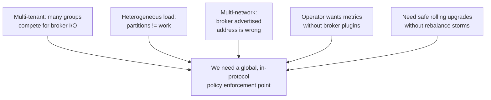
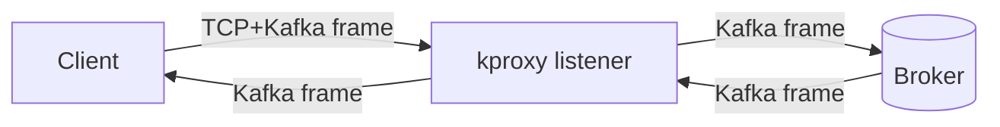
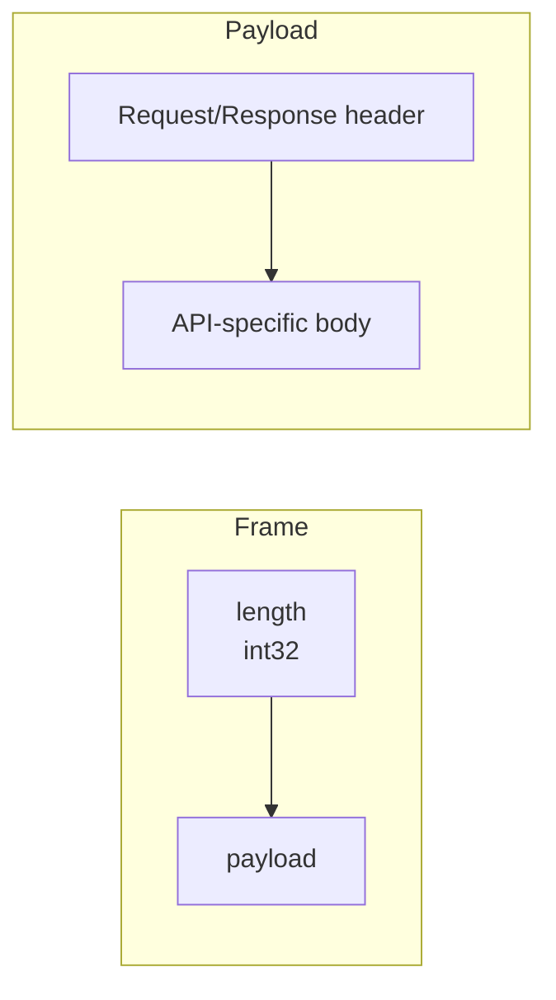
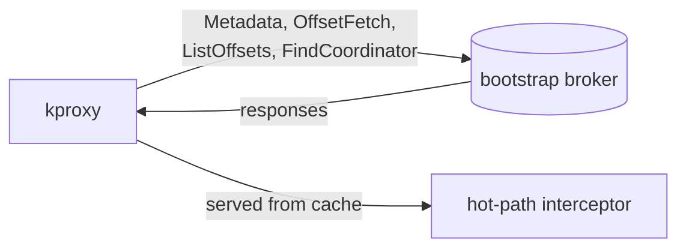
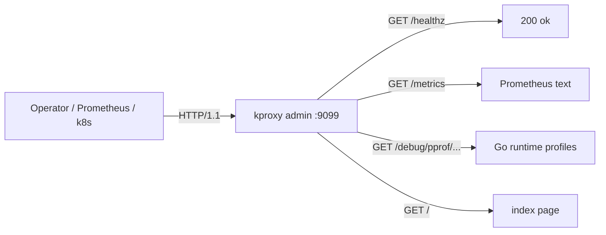
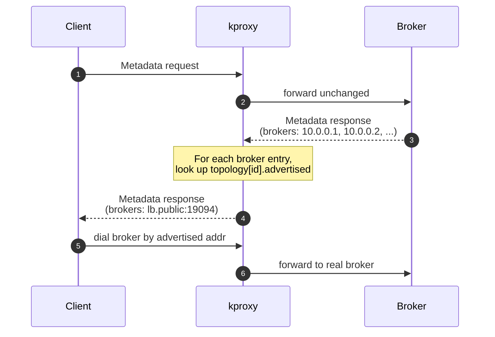
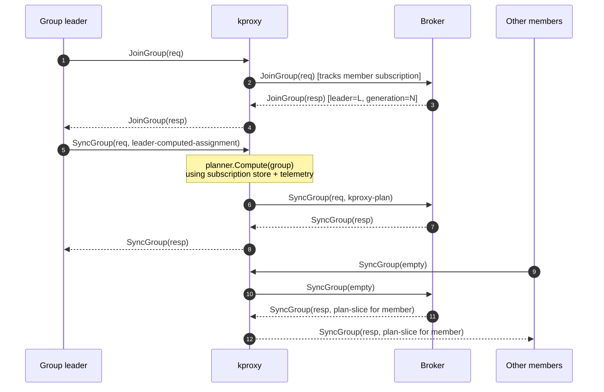
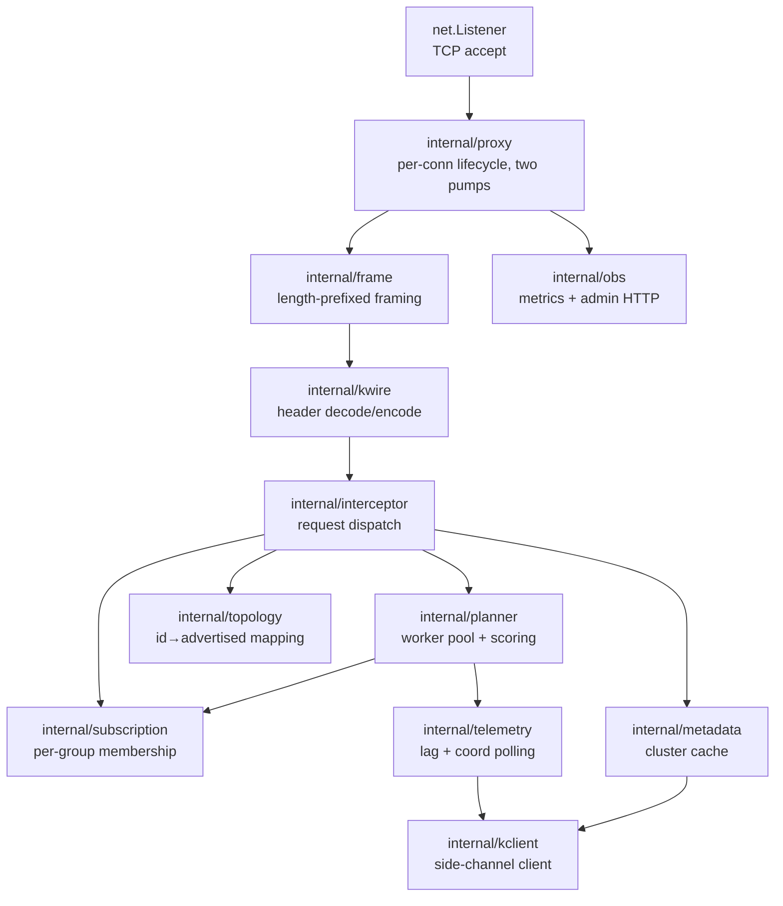

# kproxy — Protocols & Problem Statement

## 1. The problem kproxy solves

Apache Kafka's group-management protocol is designed for **local fairness**:
inside a single consumer group, members reach consensus on a partition
assignment via a leader. There is no *global* coordination across groups, no
view of *load* (only of membership), and no way to inject policy without
modifying every client.

This is fine until you reach production scale, where you typically meet at
least one of the following:

`kproxy` is that enforcement point. It speaks Kafka on both sides, decides
*per-request* whether to passthrough or rewrite, and is invisible to the
client.

### 1.1 Concrete pain points

| Pain                                                                                  | Today's workaround                          | What kproxy gives                                            |
| ------------------------------------------------------------------------------------- | ------------------------------------------- | ------------------------------------------------------------ |
| Group A starves group B on shared brokers                                             | Per-tenant clusters, broker quotas          | Cross-group plan that weights lag + connection fan-in        |
| Broker `advertised.listeners` doesn't match client network                            | Rolling broker restart per network          | Static topology mapping rewritten on every Metadata response |
| One group rebalance triggers full re-fetch of every other group's `__consumer_offsets` | Batch deploys, pray                        | Drain-aware proxy lifecycle, no broker bounce                |
| No per-API observability without JMX or broker plugin                                 | jmx_exporter, kminion, etc.                 | Built-in `/metrics` (Prometheus text) + pprof                |
| Different networks need different broker URLs                                         | Per-network listener configs                | One topology file, hot-swappable per proxy instance          |

---

## 2. Protocols spoken by kproxy

### 2.1 Apache Kafka wire protocol (data plane)

This is the only protocol kproxy speaks on its main listener.

Frame layout (all sizes are big-endian):

* The **frame** boundary (`length` int32 prefix + payload bytes) is parsed
  by `internal/frame`.
* The **header** is parsed by `internal/kwire`. Both *flexible* (KIP-482,
  tagged-fields) and *non-flexible* headers are supported, per-API.
* The **body** is forwarded byte-for-byte unless the API is on the rewrite
  list (see §3).

Supported transport: **TCP, PLAINTEXT only.** TLS termination must happen
*above* kproxy (e.g. service-mesh proxy, HAProxy, AWS NLB). SASL is *not*
intercepted; SASL frames pass through but kproxy does not authenticate
itself to the broker.

### 2.2 APIs kproxy actively rewrites

These are the only APIs the proxy decodes beyond the header. Everything
else flows through unchanged.

| API key | API name             | Direction        | Why                                                                                  |
| ------- | -------------------- | ---------------- | ------------------------------------------------------------------------------------ |
| 3       | `Metadata`           | response rewrite | Replace each `Broker.host:port` with the topology-mapped advertised address          |
| 10      | `FindCoordinator`    | response rewrite | Same — coordinator address is a broker host:port                                     |
| 11      | `JoinGroup`          | request observe  | Track member subscriptions per group (feeds the planner)                             |
| 14      | `SyncGroup`          | request rewrite  | Replace the group leader's assignment with the planner's globally-fair plan          |

### 2.3 APIs kproxy passes through (verified live)

`ApiVersions` (18), `Heartbeat` (12), `LeaveGroup` (13), `OffsetCommit`
(8), `OffsetFetch` (9), `Fetch` (1), `Produce` (0), `InitProducerID` (22),
`AddPartitionsToTxn` (24), `AddOffsetsToTxn` (25), `EndTxn` (26),
`DescribeGroups` (15), `ListGroups` (16), `DescribeConfigs` (32), and
every other API the broker implements. The proxy never needs to know
about new APIs added in future Kafka releases.

### 2.4 Side-channel: `kclient` to broker (control plane)

For metadata refresh and telemetry polling, kproxy keeps **one outbound
TCP connection** to a configured bootstrap broker (`-bootstrap`,
defaults to `-broker`). It uses an internal mini-client
(`internal/kclient`) that issues:

* `Metadata` requests (every `-refresh`, default 30 s)
* `OffsetFetch` and `ListOffsets` per active group (every `-telemetry`,
  default 15 s) to compute lag

This is a **separate** connection from the per-client conns; an outage of
the side-channel only stales the metadata/telemetry cache, never breaks
client traffic — the proxy degrades to passthrough.

### 2.5 HTTP admin (operations plane)

Bound to `127.0.0.1` by default. Bind to `0.0.0.0` only behind a trusted
LB.

---

## 3. The two intercept paths in detail

### 3.1 Path A — Topology rewriting (`Metadata`, `FindCoordinator`)

Failure modes:

* **Unknown broker id** → counter `kproxy_unmapped_brokers_total++`,
  original (broker-advertised) address is forwarded so the client at least
  has *something* to try (best-effort).
* **No topology configured** → all brokers are unmapped, proxy effectively
  becomes a single-broker forwarder (the fallback default).

### 3.2 Path B — Plan rewriting (`JoinGroup`, `SyncGroup`)

Why rewrite the *request* and not the *response*?

* The broker's `__consumer_offsets` log durably records the assignment from
  the leader's request. If we rewrote only responses, the broker's persisted
  state would diverge from what members see — a single restart of the proxy
  would resync to the broker's (wrong, leader-local) plan.
* By rewriting the request, every member's response naturally carries the
  proxy's plan because the broker re-broadcasts what the leader sent.

Failure modes:

* **Planner timeout (`-plan-timeout` exceeded)** → original payload
  forwarded; counter `intercepts_total{outcome="timeout"}++`.
* **Planner error** → same fallback; counter `outcome="error"++`.
* **Planner queue full** → same fallback (backpressure does not block the
  hot path).

---

## 4. Protocol layering inside the binary

Every box is `stdlib + go.mod = github.com/mohsanabbas/kproxy`. No third-
party dependencies in the proxy binary.

---

## 5. What kproxy proposes

### 5.1 A protocol-aware sidecar pattern for Kafka

Today the only ways to influence Kafka group assignment are:

1. Replace the assignor on every client (deploy coordination + library
   support).
2. Patch the broker (operationally infeasible for managed Kafka).

kproxy proposes a third path: **a thin protocol-aware proxy that owns the
SyncGroup rewrite point**. Because the rewrite is wire-form-only, no client
or broker code changes. Operators get a single place to express
cross-cutting policy.

### 5.2 A unified topology indirection layer

`advertised.listeners` is per-broker, per-listener-name, and requires a
restart to change. kproxy proposes **topology as runtime config** — a
mapping file (or flag) that the proxy consults on every Metadata response.
You can ship a new topology with a config-map rollout instead of a broker
roll.

### 5.3 In-protocol observability

Rather than hooking JMX, scraping logs, or running a sidecar exporter,
kproxy emits the metrics that matter (frames, intercepts, planner timing,
unmapped brokers) directly from the proxy's hot path. The values are
authoritative because the proxy *is* the byte-for-byte forwarder.

### 5.4 A safe rolling-upgrade contract

Most Kafka clients react badly to broker disconnects. kproxy proposes
**graceful drain on signal** as a first-class feature: SIGTERM → close
listener → finish in-flight RPCs → exit. Pair with k8s
`terminationGracePeriodSeconds` ≥ `-drain-timeout` and proxy pods can be
cycled at will.

### 5.5 A small, auditable codebase

The whole proxy is stdlib-only Go. Every API key it understands is hand-
written in `internal/kwire`. New APIs added by Kafka releases never break
the data path because unknown APIs are forwarded byte-for-byte. The
auditable surface is a few thousand lines, easily reviewed by a security
team for use in regulated environments.

---

## 6. Non-goals

* **Not a message router.** kproxy never inspects record batches.
* **Not a schema enforcement point.** Use Schema Registry.
* **Not a replacement for ACLs.** Broker ACLs still apply; kproxy does not
  add or remove permissions.
* **Not a multi-cluster mirror.** One proxy fronts one upstream broker per
  accepted client conn (DaemonSet + topology mapping for multi-broker).
* **Not transparent for SASL.** Run cleartext Kafka behind kproxy or
  terminate SASL above it.

---

## 7. References

* Kafka protocol guide: <https://kafka.apache.org/protocol>
* KIP-482 (flexible versions): tagged-fields wire encoding
* KIP-394 (cooperative-sticky assignor)
* `internal/kwire` source — the canonical implementation of the
  request/response headers kproxy understands.
